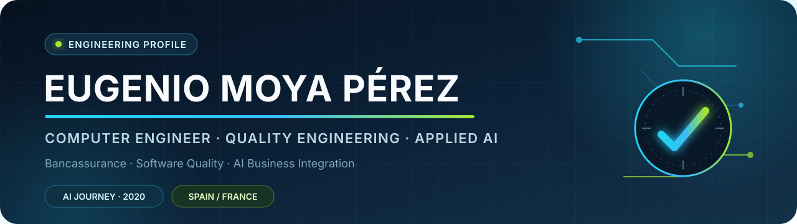

  

  
  
  

  <strong>Computer Engineer — Information Technologies</strong> 
  Senior QA Specialist in Banking & Insurance · Applied AI and business integration since GPT-3 (2020)

  I connect <strong>software quality</strong>, <strong>engineering</strong> and
  <strong>responsible AI adoption</strong> to turn emerging technology into reliable products and measurable business value.

---

## Professional profile

<table>
  <tr>
    <td width="33%" valign="top">
      <h3 align="center">🛡️ Quality Assurance</h3>
      
QA strategy, functional, backend and API validation, hybrid manual/automated testing, defect management and continuous improvement in complex, regulated environments.

    </td>
    <td width="33%" valign="top">
      <h3 align="center">🧠 Applied AI</h3>
      
Hands-on work with generative, agentic and multimodal AI since 2020: local models, vision, speech, evaluation and privacy-first inference.

    </td>
    <td width="33%" valign="top">
      <h3 align="center">🏦 Business Integration</h3>
      
Bancassurance specialization, participation in the Quality Services innovation and AI adoption committee, and practical integration of AI into delivery and consulting models.

    </td>
  </tr>
</table>

> **Current role:** Software Quality Assurance · Senior QA Specialist at **NTT DATA · Banking & Insurance** 
> **Innovation:** contributor to the **Innovation & AI Adoption Committee in Quality Services** 
> **Engineering background:** Computer Engineering, Information Technologies track · **Universitat Oberta de Catalunya (UOC)** 
> **AI journey:** started with **GPT-3 in 2020** and evolved towards generative, agentic, local and product-oriented AI 
> **Knowledge enablement:** employee training in practical generative and agentic AI adoption during 2026 
> **International environment:** current project delivered in English · ongoing French immersion at home

## Academic capstone · PortalQA

<table>
  <tr>
    <td valign="top">
      <h3>🧪 PortalQA — Quality Assurance Operations Hub</h3>
      
<strong>Computer Engineering final degree project (UOC, 2024/25)</strong> focused on centralizing everyday QA workflows in a controlled web environment.

      
The prototype combines role-based access, test-data generation for Spanish identifiers and IBANs, realistic address generation, visual text comparison with PDF export, date calculations, employee administration and configurable tools.

      

        
        
        
        
      

      
<strong>Modernization direction:</strong> PHP 8, hardened authentication and sessions, CSRF protection, automated API/security tests, CI and containerized delivery. It is a practical bridge between my academic foundation and my current QA and AI-integration work.

    </td>
  </tr>
</table>

## Selected engineering work

<table>
  <tr>
    <td width="50%" valign="top">
      <h3><a href="https://github.com/EMoyaP/UGAssistant">🤖 UGAssistant</a></h3>
      
Local multimodal assistant for Windows and Raspberry Pi 5: vision, gestures, wake words, Whisper, Piper and Gemma through Ollama.

      

        
        
        
      

    </td>
    <td width="50%" valign="top">
      <h3><a href="https://github.com/EMoyaP/UGscaler">📷 UGscaler</a></h3>
      
Privacy-first Android photo restoration with BSRGAN/NCNN, context-aware cropping, measurable quality gates and optional local Stable Diffusion for image-to-image and prompt generation.

      

        
        
        
        
      

    </td>
  </tr>
  <tr>
    <td width="50%" valign="top">
      <h3><a href="https://github.com/EMoyaP/UGscan">📡 UGscan</a></h3>
      
Android Wi-Fi diagnostics with live network metrics, speed testing and ARCore-tagged measurements over real surfaces.

      

        
        
      

    </td>
    <td width="50%" valign="top">
      <h3><a href="https://github.com/EMoyaP/UGasolineras">⚡ UGasolineras</a></h3>
      
Android mobility app for nearby fuel stations and EV charging points, with maps, intelligent cache and Android Auto foundations.

      

        
        
      

    </td>
  </tr>
  <tr>
    <td width="50%" valign="top">
      <h3><a href="https://github.com/EMoyaP/UGstreaming">🎬 UGstreaming</a></h3>
      
Multilingual Android discovery experience for films and series in Spain, combining catalogue data, provider availability and AI summaries.

      

        
        
      

    </td>
    <td width="50%" valign="top">
      <h3><a href="https://github.com/EMoyaP/UGextractor">🧰 UGextractor</a></h3>
      
Portable Windows application for controlled media workflows across websites, local storage and Telegram channels.

      

        
        
      

    </td>
  </tr>
</table>

## Capability map

  
  
  
  
  

  
  
  
  
  
  

  
  
  
  
  
  

  
  
  
  

## Engineering trajectory

My public repositories show both current product work and the foundations behind it:

- **Current products:** local and on-device AI, Android applications, computer vision, networking, mobility and automation.
- **Quality mindset:** acceptance criteria, measurable quality gates, reproducible builds, local-first privacy, model checksums, fallback paths and non-commercial licensing.
- **Foundations:** procedural programming in C, object-oriented design in Java and statistical analysis in R.

  
<strong>Explore the complete public learning and engineering archive</strong>

   

  **C · Fundamentals and programming practices**

  [`C_FP_PEC1`](https://github.com/EMoyaP/C_FP_PEC1_20211) ·
  [`C_FP_PEC2`](https://github.com/EMoyaP/C_FP_PEC2_20211) ·
  [`C_FP_PEC3`](https://github.com/EMoyaP/C_FP_PEC3_20211) ·
  [`C_FP_PEC4`](https://github.com/EMoyaP/C_FP_PEC4_20211) ·
  [`C_FP_PEC5`](https://github.com/EMoyaP/C_FP_PEC5_20211) ·
  [`C_FP_PEC6`](https://github.com/EMoyaP/C_FP_PEC6_20211) ·
  [`C_FP_PEC7`](https://github.com/EMoyaP/C_FP_PEC7_20211) ·
  [`C_FP_PEC8`](https://github.com/EMoyaP/C_FP_PEC8_20211) ·
  [`C_FP_PR1`](https://github.com/EMoyaP/C_FP_PR1_20211) ·
  [`C_FP_PR2`](https://github.com/EMoyaP/C_FP_PR2_20211)

  **C · Programming projects**

  [`C_PP_PEC1`](https://github.com/EMoyaP/C_PP_PEC1_20212) ·
  [`C_PP_PEC2`](https://github.com/EMoyaP/C_PP_PEC2_20212) ·
  [`C_PP_PR1`](https://github.com/EMoyaP/C_PP_PR1_20212) ·
  [`C_PP_PR2`](https://github.com/EMoyaP/C_PP_PR2_20212) ·
  [`C_PP_PR3`](https://github.com/EMoyaP/C_PP_PR3_20212)

  **Java · Object-oriented design**

  [`JAVA_DPOO_PEC1`](https://github.com/EMoyaP/JAVA_DPOO_PEC1_20221) ·
  [`JAVA_DPOO_PEC2`](https://github.com/EMoyaP/JAVA_DPOO_PEC2_20221) ·
  [`JAVA_DPOO_PEC3`](https://github.com/EMoyaP/JAVA_DPOO_PEC3_20221) ·
  [`JAVA_DPOO_PEC4`](https://github.com/EMoyaP/JAVA_DPOO_PEC4_20221) ·
  [`JAVA_DPOO_PR2`](https://github.com/EMoyaP/JAVA_DPOO_PR2_20221)

  **R · Statistics**

  [`R_ESTADISTICA_PEC1`](https://github.com/EMoyaP/R_ESTADISTICA_PEC1_20221) ·
  [`R_ESTADISTICA_PEC2`](https://github.com/EMoyaP/R_ESTADISTICA_PEC2_20221) ·
  [`R_ESTADISTICA_PEC3`](https://github.com/EMoyaP/R_ESTADISTICA_PEC3_20221) ·
  [`R_ESTADISTICA_PEC4`](https://github.com/EMoyaP/R_ESTADISTICA_PEC4_20221)

  **Curated reference fork**

  [`Chuletas`](https://github.com/EMoyaP/Chuletas) · command and development reference material.

## GitHub activity

  
  

  

## Credentials and focus

- **ISTQB Certified Tester Foundation Level**
- **CCNA: Enterprise Networking, Security and Automation**
- **Postman API Fundamentals Student Expert**
- **GenAI Academy: Yellow Belt Level 1**
- **Responsive Web Design**
- **English B2** · current international project delivered in English
- **French** · ongoing home-immersion environment
- **Currently preparing:** ISTQB Certified Tester AI Testing (CT-AI)
- Current focus: AI-enhanced QA, trustworthy automation, local multimodal systems and quality assurance for banking and insurance.

## Contact

  <strong>Interested in quality engineering, responsible AI adoption or product-focused experimentation?</strong>  
  

  Engineering with quality · AI with purpose · Innovation with accountability

